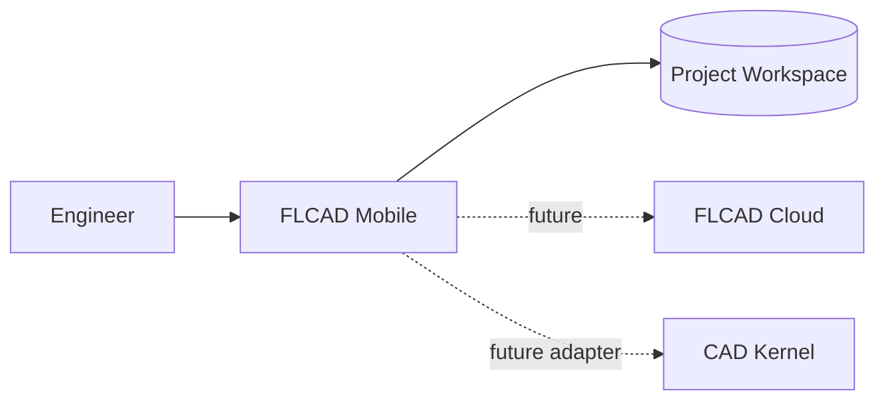
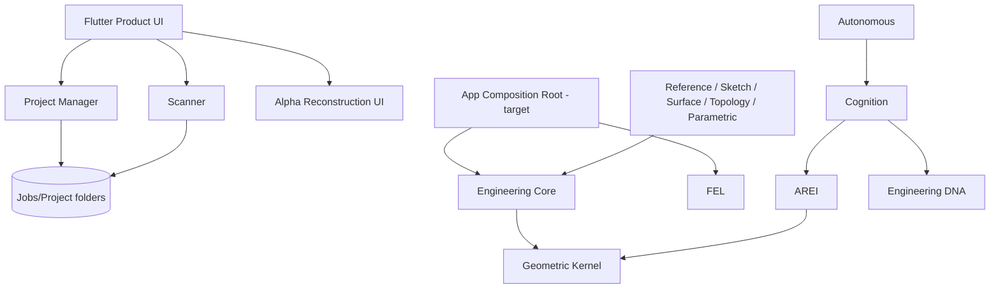
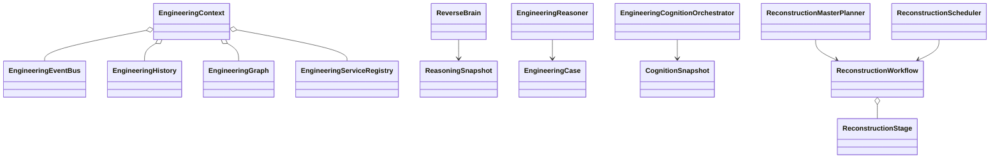
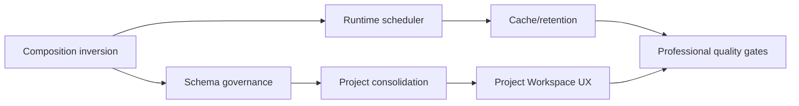

# Consolidated Architecture — AR-001

## C4 context

```mermaid
flowchart LR
  User[Engineer] --> Mobile[FLCAD Mobile]
  Mobile --> ProjectStore[(Project Workspace)]
  Mobile -. future .-> Cloud[FLCAD Cloud]
  Mobile -. future adapter .-> CAD[CAD Kernel]
```

## C4 containers/components

```mermaid
flowchart TD
  UI[Flutter Product UI] --> PM[Project Manager]
  UI --> Scanner
  UI --> ReconstructionUI[Alpha Reconstruction UI]
  PM --> Store[(Jobs/Project folders)]
  Scanner --> Store
  Composition[App Composition Root - target] --> EC[Engineering Core]
  Composition --> FEL
  EC --> GK[Geometric Kernel]
  AREI --> GK
  Cognition --> AREI
  Cognition --> DNA[Engineering DNA]
  Autonomous --> Cognition
  Domains[Reference / Sketch / Surface / Topology / Parametric] --> EC
```

## Core UML

```mermaid
classDiagram
  EngineeringContext o-- EngineeringEventBus
  EngineeringContext o-- EngineeringHistory
  EngineeringContext o-- EngineeringGraph
  EngineeringContext o-- EngineeringServiceRegistry
  ReverseBrain --> ReasoningSnapshot
  EngineeringReasoner --> EngineeringCase
  EngineeringCognitionOrchestrator --> CognitionSnapshot
  ReconstructionMasterPlanner --> ReconstructionWorkflow
  ReconstructionWorkflow o-- ReconstructionStage
  ReconstructionScheduler --> ReconstructionWorkflow
```

## Roadmap dependency

```mermaid
flowchart LR
  R1[Composition inversion] --> R2[Schema governance]
  R1 --> R4[Runtime scheduler]
  R2 --> R3[Project consolidation]
  R4 --> R5[Cache/retention]
  R3 --> R7[Project Workspace UX]
  R5 --> R8[Professional quality gates]
  R7 --> R8
```
