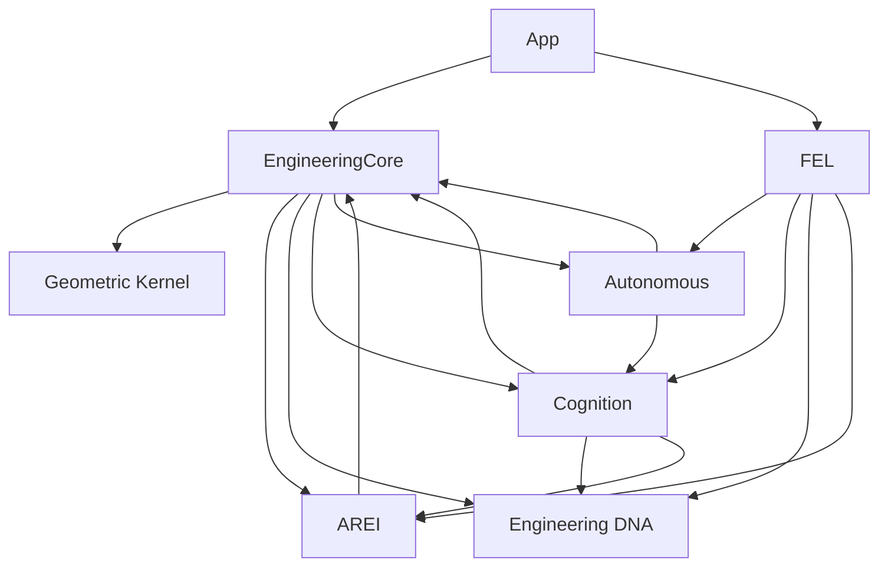
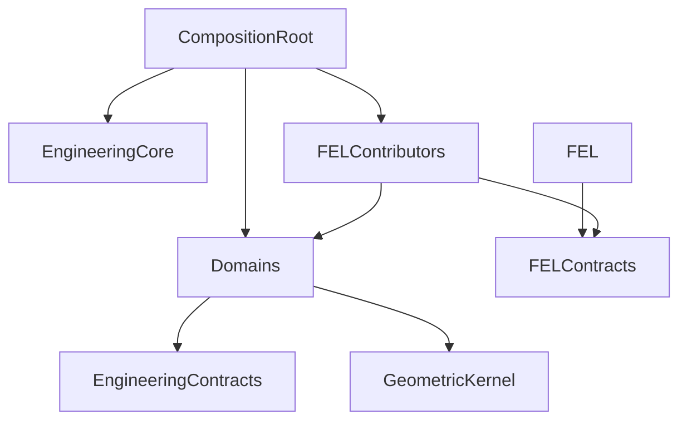

# Dependency Audit

## Observed graph

## Cycles

Static import cycles exist at module level because `EngineeringContext` is a composition root and because `native_commands.dart` aggregates domain commands. Notable strongly connected groups are:

- Engineering ↔ Geometric Kernel;
- Engineering ↔ AREI ↔ Engineering DNA ↔ Cognition ↔ Autonomous Reconstruction;
- FEL ↔ Smart Regions, Reference, Sketch, Surface, Topology, Parametric, AREI, DNA, Cognition and Autonomous Reconstruction.

Dart accepts these library imports, but they obstruct package extraction, independent compilation and Desktop/Cloud reuse.

## Coupling hotspots

- `core/engineering/context/engineering_context.dart`: knows every strategic domain.
- `core/fel/commands/native_commands.dart`: knows every FEL extension.
- `core/smart_regions/models/geometry.dart`: legacy `Vec3` and `MeshTopology` remain shared across domains despite the Geometric Kernel adapter.
- `adaptive_surface` imports Smart Regions, Reference, Sketch, FEL and Engineering.

## Orphans

No strategic engine is completely orphaned; each is referenced by tests or a composition path. Some contracts have no production implementation by design: GPU/Cloud backends, advanced spatial trees, CAD adapters and several plugin contracts.

## Target graph

The app composition root, not Engineering Core or FEL, should join implementations.
