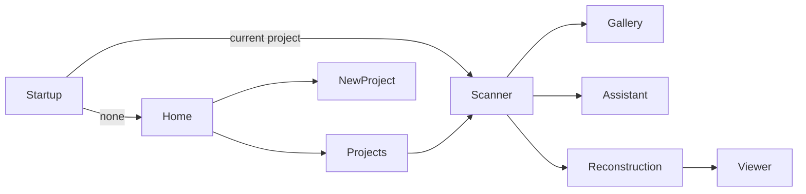

# Mobile UX Audit

## Current visible flow

Automatic continuation to the active project is correctly implemented. Scanner provides direct access to Assistant, Reconstruction and Projects.

## Friction

1. Home and Projects duplicate project creation/opening paths.
2. Scanner top-bar icons carry the primary navigation; there is no persistent workflow/timeline surface for reconstruction.
3. Interrupted reconstruction prompts immediately when Scanner opens, competing with capture intent.
4. Scale-method selection exists inside a large capture widget and adds a modal decision during scanning.
5. References, Sketch, Surface, Topology, Engineering DNA, Cognition and Autonomous workflow have no integrated product screens.
6. Reconstruction shows pipeline events but not dependencies, confidence, alternatives or next-step rationale already available from Autonomous Reconstruction.
7. Legacy `features/home/projects` and current `features/projects` indicate two UX generations remaining in the tree.

## Productivity opportunities

- Make one Project Workspace the navigation shell for Capture, Analyze, Plan and Review.
- Surface the Autonomous `ReconstructionUiState` as a non-blocking next-step card.
- Replace startup interruption modal with a resumable status card unless data safety requires immediate choice.
- Consolidate project creation and remove legacy screens after compatibility migration.
- Preserve expert shortcuts through FEL while exposing the same plan and explanations visually.

No UI changes were made in AR-001.
