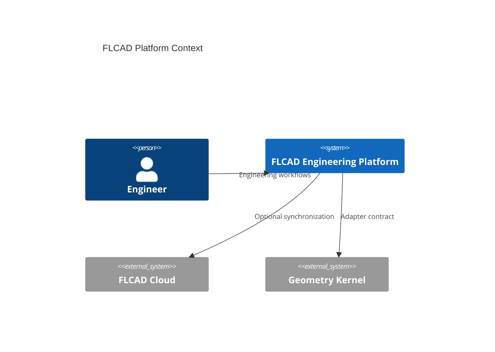
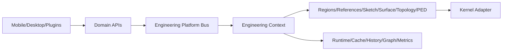

# FLCAD Engineering Platform Architecture

Princípios: Project First, entidades referenciadas por ID, geometrias pesadas fora do JSON, comandos separados de queries, comunicação transversal via EPB e kernels atrás de adapters.

