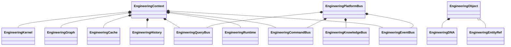

# UML and C4 Component View

```mermaid
classDiagram
  EngineeringContext *-- EngineeringRuntime
  EngineeringContext *-- EngineeringEventBus
  EngineeringContext *-- EngineeringCommandBus
  EngineeringContext *-- EngineeringQueryBus
  EngineeringContext *-- EngineeringHistory
  EngineeringContext *-- EngineeringCache
  EngineeringContext *-- EngineeringGraph
  EngineeringContext *-- EngineeringKernel
  EngineeringPlatformBus *-- EngineeringEventBus
  EngineeringPlatformBus *-- EngineeringCommandBus
  EngineeringPlatformBus *-- EngineeringQueryBus
  EngineeringPlatformBus *-- EngineeringKnowledgeBus
  EngineeringObject o-- EngineeringEntityRef
  EngineeringObject *-- EngineeringDNA
```
